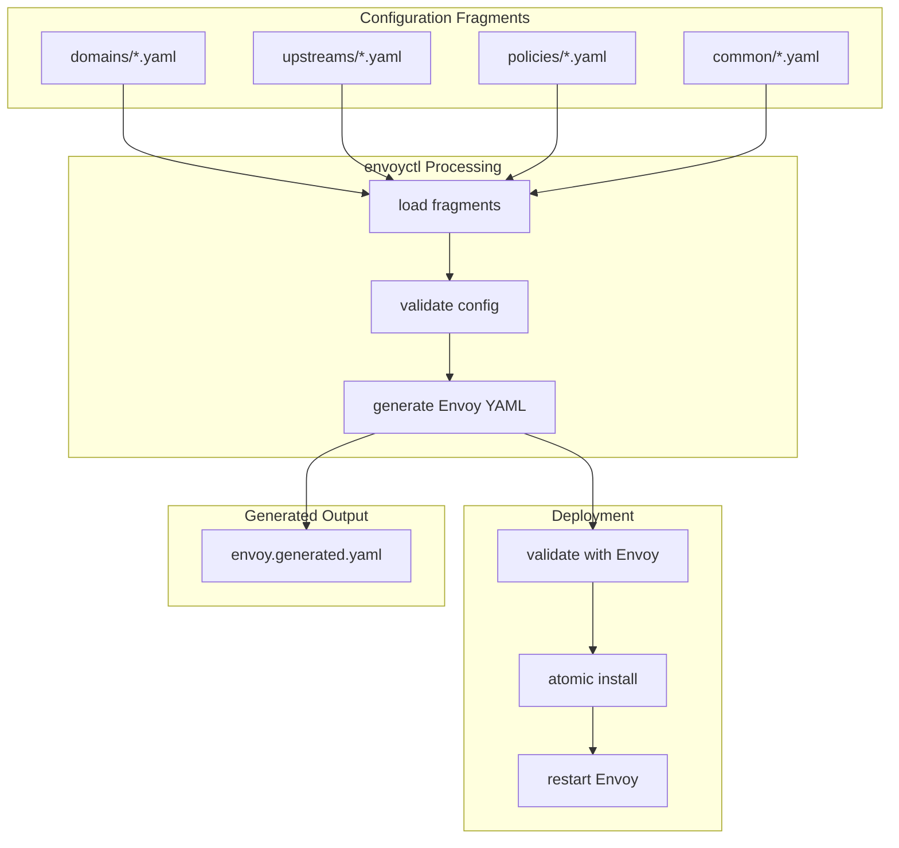

# envoyctl

[](LICENSE)

**envoyctl** is a configuration management and deployment tool for [Envoy Proxy](https://www.envoyproxy.io/).

It lets you manage complex Envoy configurations using **small, focused YAML fragments** and validates the generated configuration using Envoy itself.

## Architecture Overview



---

## Table of Contents

- [What is Envoy?](#what-is-envoy)
- [Why envoyctl?](#why-envoyctl)
- [Features](#features)
- [Quick Start](#quick-start)
- [Installation](#installation)
- [Workspace Layout](#workspace-layout)
- [Configuration Examples](#configuration-examples)
- [Commands](#commands)
- [TLS Behavior](#tls-behavior)
- [Validation & Safety](#validation--safety)
- [Docker Deployment](#docker-deployment)
- [Contributing](#contributing)
- [License](#license)

---

## What is Envoy?

[Envoy](https://www.envoyproxy.io/) is a high-performance, open-source edge and service proxy designed for cloud-native applications. Originally built at Lyft, it's now a graduated [CNCF](https://www.cncf.io/) project used by companies like Google, Microsoft, and Amazon.

### What Envoy Does

| Capability | Description |
|------------|-------------|
| **Load Balancing** | Distributes traffic across backend services with multiple algorithms |
| **TLS Termination** | Handles HTTPS connections at the edge, offloading encryption from backends |
| **TLS Passthrough** | Routes encrypted traffic based on SNI without decrypting |
| **Reverse Proxy** | Routes HTTP/HTTPS requests to appropriate backend services |
| **Rate Limiting** | Protects services from abuse and overload |
| **Health Checking** | Monitors backend health and removes unhealthy instances |
| **Observability** | Provides detailed metrics, logging, and tracing |

### Common Use Cases

- **API Gateway**: Route and secure API traffic
- **Edge Proxy**: Handle incoming traffic at the network edge
- **Service Mesh Sidecar**: Proxy service-to-service communication (used by Istio)
- **Load Balancer**: Distribute traffic across multiple backends

### The Configuration Challenge

Envoy is incredibly powerful, but its configuration can be complex:

```yaml
# A simple Envoy route requires this much YAML...
static_resources:
  listeners:
    - name: listener_0
      address:
        socket_address:
          address: 0.0.0.0
          port_value: 443
      filter_chains:
        - filters:
            - name: envoy.filters.network.http_connection_manager
              typed_config:
                "@type": type.googleapis.com/envoy.extensions.filters.network.http_connection_manager.v3.HttpConnectionManager
                stat_prefix: ingress_http
                route_config:
                  name: local_route
                  virtual_hosts:
                    - name: backend
                      domains: ["example.com"]
                      routes:
                        - match:
                            prefix: "/"
                          route:
                            cluster: my_backend
# ... and this continues for clusters, TLS, etc.
```

**This is where envoyctl helps.** It generates this complex configuration from simple, human-readable fragments.

---

## Why envoyctl?

As Envoy configurations grow, they become difficult to manage:

| Problem | envoyctl Solution |
|---------|-------------------|
| Routes, listeners, clusters scattered across giant files | Small, focused YAML fragments |
| Small changes require editing large files | Edit one file per domain/upstream |
| Validation happens late (or not at all) | Always validated before apply |
| Rollouts are risky | Atomic install, rollback on failure |
| Hard to audit changes | Deterministic, documented output |

### How envoyctl Simplifies Configuration

Instead of writing hundreds of lines of Envoy YAML, you write this:

```yaml
# config/domains/example.com.yaml
domain: example.com
mode: terminate_https_443
tls:
  cert_chain: /etc/envoy/certs/example.com/fullchain.pem
  private_key: /etc/envoy/certs/example.com/privkey.pem
routes:
  - match: { prefix: "/api/" }
    to_upstream: api_backend
  - match: { prefix: "/" }
    to_upstream: web_frontend
```

```yaml
# config/upstreams/api_backend.yaml
name: api_backend
connect_timeout: 2s
type: STRICT_DNS
lb_policy: ROUND_ROBIN
endpoints:
  - { address: "api-service", port: 8080 }
```

Then run:

```bash
envoyctl build    # Generate full Envoy config
envoyctl validate # Validate with Envoy
envoyctl apply    # Install and restart
```

---

## Features

- **Fragment-based configuration** — `domains/`, `upstreams/`, `policies/`
- **Generates Envoy v3 static configuration**
- **Default TLS passthrough** on :443, with explicit SNI termination
- **Built-in validation** using Envoy (`--mode validate`)
- **Docker support** — validate and run via containers
- **systemd integration** — oneshot service + timer
- **Atomic config installation** — no partial updates
- **Works on Debian/Ubuntu** — APT repository available

---

## Quick Start

### 1. Initialize a Workspace

```bash
envoyctl init --dir ./my-envoy-config
cd ./my-envoy-config
```

### 2. Edit Your Configuration

```bash
# Edit the example domain
vim config/domains/example.com.yaml

# Edit the backend upstream  
vim config/upstreams/api_backend.yaml
```

### 3. Validate

```bash
envoyctl validate --config-dir ./config --out-dir ./out
```

### 4. Apply (Install + Restart Envoy)

```bash
envoyctl apply --config-dir ./config --out-dir ./out
```

---

## Installation

### From Source (Rust)

```bash
# Clone the repository
git clone https://github.com/your-username/envoyctl.git
cd envoyctl

# Build
cargo build --release

# Install
sudo cp target/release/envoyctl /usr/local/bin/
```

### From APT Repository (Debian/Ubuntu)

```bash
# 1. Add the repository signing key
sudo mkdir -p /etc/apt/keyrings
curl -fsSL https://boniface.github.io/envoyctl/public.gpg \
  | sudo gpg --dearmor -o /etc/apt/keyrings/envoyctl-archive-keyring.gpg

# 2. Add the APT repository
echo "deb [signed-by=/etc/apt/keyrings/envoyctl-archive-keyring.gpg] https://boniface.github.io/envoyctl stable main" \
  | sudo tee /etc/apt/sources.list.d/envoyctl.list

# 3. Install
sudo apt update
sudo apt install envoyctl
```

### What Gets Installed (APT)

| Path | Description |
|------|-------------|
| `/usr/bin/envoyctl` | CLI tool |
| `/usr/share/envoyctl/templates/` | Workspace templates |
| `/etc/default/envoyctl` | Runtime configuration |
| `/var/lib/envoyctl/work/` | Default workspace |

---

## Workspace Layout

```mermaid
C4Component
    title Workspace Layout for envoyctl
    Container_Boundary(workspace, "my-envoy-config/") {
        Container_Boundary(config, "config/", "Configuration fragments") {
            Container_Boundary(common, "common/", "Shared settings") {
                Component(admin, "admin.yaml", "YAML", "Envoy admin interface")
                Component(defaults, "defaults.yaml", "YAML", "Global defaults")
                Component(runtime, "runtime.yaml", "YAML", "Validation settings")
                Component(access_log, "access_log.yaml", "YAML", "Logging configuration")
                Component(default_http, "default_http_backend.yaml", "YAML", "Default HTTP backend")
                Component(default_tls, "default_tls_backend.yaml", "YAML", "Default TLS backend")
            }
            Container_Boundary(domains, "domains/", "Domain definitions") {
                Component(domain_example, "example.com.yaml", "YAML", "One file per domain")
            }
            Container_Boundary(upstreams, "upstreams/", "Backend clusters") {
                Component(upstream_api, "api_backend.yaml", "YAML", "One file per backend")
                Component(upstream_web, "web_frontend.yaml", "YAML", "One file per backend")
            }
            Container_Boundary(policies, "policies/", "Reusable policies") {
                Component(headers, "headers.yaml", "YAML", "Header manipulation")
                Component(ratelimits, "ratelimits.yaml", "YAML", "Rate limiting rules")
                Component(retries, "retries.yaml", "YAML", "Retry policies")
                Component(timeouts, "timeouts.yaml", "YAML", "Timeout configurations")
            }
        }
        Container_Boundary(out, "out/", "Generated output") {
            Component(generated, "envoy.generated.yaml", "YAML", "Generated config (don't edit!)")
        }
    }

    Rel(config, common, "contains")
    Rel(config, domains, "contains")
    Rel(config, upstreams, "contains")
    Rel(config, policies, "contains")
    Rel(workspace, out, "contains")
```

---

## Configuration Examples

### Adding a New Domain

Create `config/domains/api.example.com.yaml`:

```yaml
domain: api.example.com
mode: terminate_https_443

tls:
  cert_chain: /etc/envoy/certs/api.example.com/fullchain.pem
  private_key: /etc/envoy/certs/api.example.com/privkey.pem

routes:
  - match: { prefix: "/v1/" }
    to_upstream: api_v1
    timeout: 30s
    
  - match: { prefix: "/v2/" }
    to_upstream: api_v2
    timeout: 30s
    per_filter_config:
      local_ratelimit: strict
```

### Adding an Upstream

Create `config/upstreams/api_v1.yaml`:

```yaml
name: api_v1
connect_timeout: 2s
type: STRICT_DNS
lb_policy: ROUND_ROBIN
http2: true
endpoints:
  - { address: "api-v1-service", port: 8080 }
  - { address: "api-v1-service-2", port: 8080 }
```

### Rate Limiting a Route

In `config/policies/ratelimits.yaml`:

```yaml
local_ratelimits:
  strict:
    max_tokens: 30
    tokens_per_fill: 30
    fill_interval: 1s
```

Reference in your domain:

```yaml
routes:
  - match: { prefix: "/login" }
    to_upstream: auth_service
    per_filter_config:
      local_ratelimit: strict
```

---

## Commands

| Command | Description |
|---------|-------------|
| `envoyctl init` | Create a new workspace from templates |
| `envoyctl build` | Generate Envoy config from fragments |
| `envoyctl validate` | Build + validate with Envoy |

### Common Options

```bash
envoyctl [OPTIONS] <COMMAND>

Options:
  --config-dir <PATH>     Config directory [default: config]
  --out-dir <PATH>        Output directory [default: out]
  --install-path <PATH>   Install target [default: /etc/envoy/envoy.yaml]
  --envoy-bin <PATH>      Envoy binary (native mode)
  -h, --help              Print help
  -V, --version           Print version
```

### Using Custom Directories

You can specify custom configuration and output directories:

```bash
# Default paths (config/ and out/ in current directory)
envoyctl validate

# Custom config and output directories
envoyctl validate --config-dir ./my-project/envoy-config --out-dir ./my-project/generated

# Absolute paths
envoyctl validate --config-dir /home/user/configs --out-dir /tmp/envoy-output

# Different project structure
envoyctl build --config-dir ../shared-config --out-dir ./local-out
```

| Option | Description | Default |
|--------|-------------|---------|
| `--config-dir` | Folder containing `domains/`, `upstreams/`, `policies/`, `common/` | `./config` |
| `--out-dir` | Folder where `envoy.generated.yaml` is written | `./out` |

---

## TLS Behavior

| Mode | Port | Description |
|------|------|-------------|
| `terminate_https_443` | 443 | Envoy terminates TLS (requires cert/key) |
| `passthrough_443` | 443 | TLS passed through unchanged (SNI routing) |
| `http_80` | 80 | Plain HTTP |

**Default behavior for unknown domains on :443**: TLS passthrough to `default_tls_backend`.

This mirrors common edge-proxy setups and avoids breaking unknown hosts.

---

## Validation & Safety

Before any configuration is generated:

1. Fragment references are validated (upstreams exist, policies defined)
2. Envoy validates the generated config: `envoy --mode validate -c config.yaml`

The generated configuration file can then be manually deployed to Envoy.

---


---

## Docker Deployment

For Docker-based deployments, see the [Docker Deployment Tutorial](docs/docker-deployment.md).

Quick example:

```bash
# Generate and validate using Docker
envoyctl validate --config-dir ./config --out-dir ./out

# Run Envoy with the generated config
docker run -d \
  --name envoy \
  -p 80:80 -p 443:443 -p 9901:9901 \
  -v $(pwd)/out/envoy.generated.yaml:/etc/envoy/envoy.yaml:ro \
  -v /etc/envoy/certs:/etc/envoy/certs:ro \
  envoyproxy/envoy:v1.36.4
```

---

## Contributing

Contributions are welcome! Please see [CONTRIBUTING.md](CONTRIBUTING.md) for:

- Development setup
- Coding standards
- Commit guidelines
- Pull request process

### Quick Development Setup

```bash
# Clone
git clone https://github.com/boniface/envoyctl.git
cd envoyctl

# Build
cargo build

# Run tests
cargo test

# Run clippy
cargo clippy -- -D warnings
```

---

## License

MIT License

Copyright (c) 2025 Boniface Kabaso

See [LICENSE](./LICENSE) for full license text.

---

## Acknowledgements

- [Envoy Proxy](https://www.envoyproxy.io/) project
- [CNCF](https://www.cncf.io/) community
- Debian packaging community
- systemd maintainers

