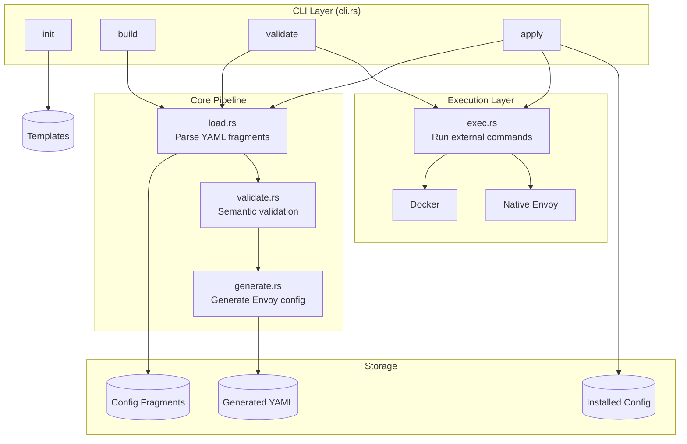
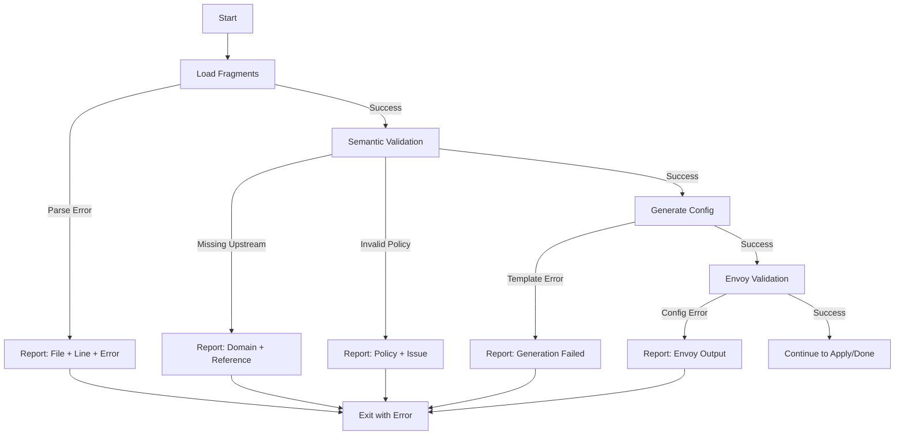

# Architecture Overview

This document describes the architecture of envoyctl and how its components interact.

---

## High-Level Architecture

```
┌─────────────────────────────────────────────────────────────────────────────┐
│                              envoyctl CLI                                    │
├─────────────────────────────────────────────────────────────────────────────┤
│                                                                              │
│  ┌──────────┐    ┌──────────┐    ┌──────────┐    ┌──────────┐              │
│  │   init   │    │  build   │    │ validate │    │  apply   │              │
│  └────┬─────┘    └────┬─────┘    └────┬─────┘    └────┬─────┘              │
│       │               │               │               │                     │
│       │               ▼               ▼               ▼                     │
│       │         ┌─────────────────────────────────────────┐                │
│       │         │              Core Pipeline              │                │
│       │         │  ┌──────┐  ┌──────────┐  ┌──────────┐  │                │
│       │         │  │ load │─▶│ validate │─▶│ generate │  │                │
│       │         │  └──────┘  └──────────┘  └──────────┘  │                │
│       │         └─────────────────────────────────────────┘                │
│       │                           │                                         │
│       ▼                           ▼                                         │
│  ┌──────────┐              ┌──────────────┐                                │
│  │ Template │              │ Envoy Config │                                │
│  │   Copy   │              │    (YAML)    │                                │
│  └──────────┘              └──────────────┘                                │
│                                   │                                         │
│                                   ▼                                         │
│                            ┌──────────────┐                                │
│                            │    exec      │                                │
│                            │  (docker/    │                                │
│                            │   native)    │                                │
│                            └──────────────┘                                │
│                                                                              │
└─────────────────────────────────────────────────────────────────────────────┘
```

---

## Component Diagram



---

## Module Responsibilities

### `main.rs`
Entry point. Parses CLI arguments and dispatches to appropriate command handlers.

### `cli.rs`
Defines the CLI structure using `clap`:
- Global options (config-dir, out-dir, install-path)
- Subcommands (init, build, validate, apply)

### `model.rs`
Data structures representing configuration fragments:
- `DomainSpec` - Domain routing configuration
- `UpstreamSpec` - Backend cluster definitions
- `PolicySpec` - Headers, rate limits, retries, timeouts
- `DefaultsSpec` - Global defaults
- `RuntimeSpec` - Validation and restart configuration

### `load.rs`
YAML loading and parsing:
- Reads all fragment files from directories
- Deserializes into model structs
- Handles file discovery and error reporting

### `validate.rs`
Semantic validation:
- Checks upstream references exist
- Validates policy references
- Ensures required fields are present
- Cross-references between fragments

### `generate.rs`
Envoy configuration generation:
- Transforms fragments into Envoy v3 config
- Builds listeners, clusters, routes
- Handles TLS configuration
- Produces final YAML output

### `apply.rs`
Command implementations:
- `cmd_build()` - Load, validate, generate
- `cmd_validate()` - Build + Envoy validation
- `cmd_apply()` - Validate + install + restart

### `exec.rs`
External command execution:
- Docker-based Envoy validation
- Native Envoy validation
- Docker Compose restarts
- systemd restarts

### `init.rs`
Workspace initialization:
- Copies template files to target directory
- Sets up directory structure

---

## Execution Modes

### Docker Validation (Recommended)

```
┌─────────────┐     ┌──────────────────────────────────┐
│  envoyctl   │────▶│  docker run envoyproxy/envoy     │
│             │     │    --mode validate               │
│             │     │    -c /mounted/config.yaml       │
└─────────────┘     └──────────────────────────────────┘
                                   │
                                   ▼
                           Validation Result
```

### Native Validation

```
┌─────────────┐     ┌──────────────────────────────────┐
│  envoyctl   │────▶│  envoy --mode validate           │
│             │     │    -c /path/to/config.yaml       │
└─────────────┘     └──────────────────────────────────┘
```

---

## Directory Structure

```
/var/lib/envoyctl/work/          # Default workspace
├── config/                       # Input: Configuration fragments
│   ├── common/                   # Shared settings
│   │   ├── admin.yaml           # Admin interface config
│   │   ├── defaults.yaml        # Global defaults
│   │   ├── runtime.yaml         # Validation/restart settings
│   │   └── access_log.yaml      # Logging configuration
│   ├── domains/                  # Domain definitions
│   │   └── *.yaml               # One file per domain
│   ├── upstreams/               # Backend clusters
│   │   └── *.yaml               # One file per upstream
│   └── policies/                # Reusable policies
│       ├── headers.yaml         # Header manipulation
│       ├── ratelimits.yaml      # Rate limiting rules
│       ├── retries.yaml         # Retry policies
│       └── timeouts.yaml        # Timeout configurations
│
└── out/                          # Output: Generated config
    └── envoy.generated.yaml     # Complete Envoy configuration
```

---

## Security Model

```
┌────────────────────────────────────────────────────────────┐
│                    systemd Hardening                        │
├────────────────────────────────────────────────────────────┤
│  • NoNewPrivileges=yes                                      │
│  • ProtectSystem=strict                                     │
│  • ReadWritePaths=/var/lib/envoyctl, /etc/envoy            │
│  • PrivateTmp=yes                                           │
└────────────────────────────────────────────────────────────┘
                              │
                              ▼
┌────────────────────────────────────────────────────────────┐
│                    Validation Pipeline                      │
├────────────────────────────────────────────────────────────┤
│  1. Load fragments (read-only)                              │
│  2. Semantic validation (in-memory)                         │
│  3. Generate config (write to out/)                         │
│  4. Envoy validation (sandboxed)                            │
│  5. Atomic install (if validation passes)                   │
│  6. Restart Envoy (controlled)                              │
└────────────────────────────────────────────────────────────┘
```

---

## Error Handling Flow



---

## Future Architecture Considerations

### Planned Improvements

1. **Watch Mode**: File system watching for auto-rebuild
2. **Dry Run**: Show what would change without applying
3. **Diff Output**: Compare current vs. generated config
4. **Remote Apply**: Push config to remote Envoy instances
5. **Config Linting**: Additional semantic checks

### Extension Points

- Custom validators (plugin system)
- Alternative output formats (xDS, etc.)
- Multiple Envoy instance support
- Secrets management integration

