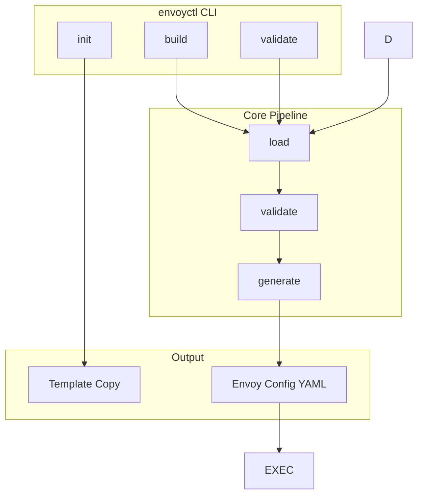
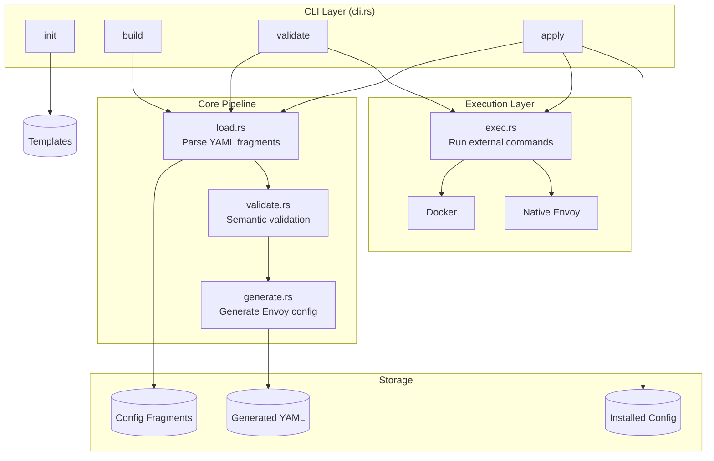
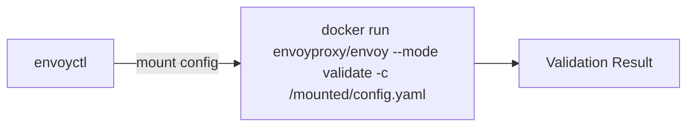
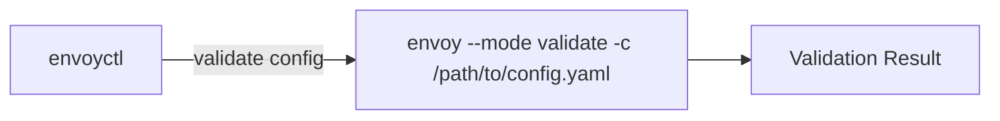
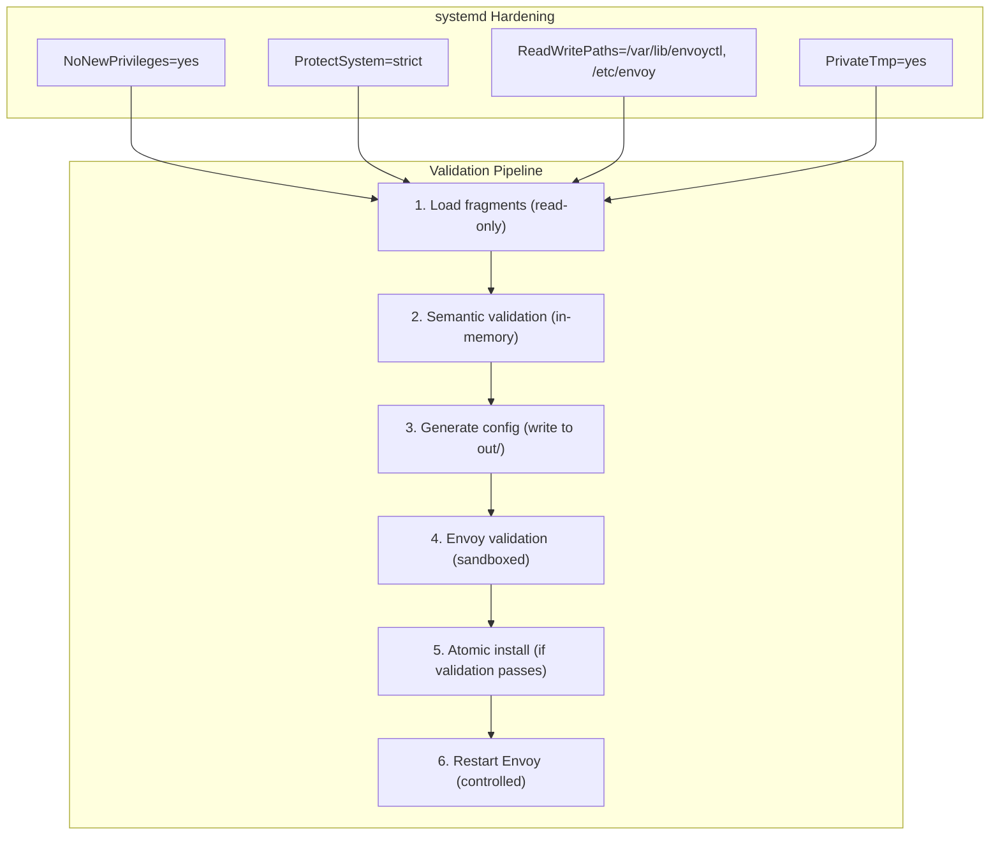
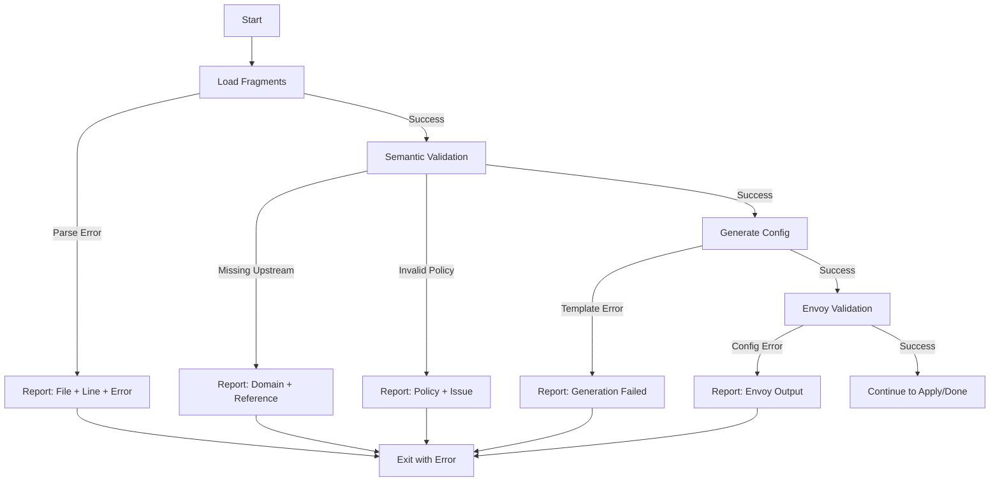

# Architecture Overview

This document describes the architecture of envoyctl and how its components interact.

---

## High-Level Architecture



---

## Component Diagram



---

## Module Responsibilities

### `main.rs`
Entry point. Parses CLI arguments and dispatches to appropriate command handlers.

### `cli.rs`
Defines the CLI structure using `clap`:
- Global options (config-dir, out-dir, install-path)
- Subcommands (init, build, validate, apply)

### `model.rs`
Data structures representing configuration fragments:
- `DomainSpec` - Domain routing configuration
- `UpstreamSpec` - Backend cluster definitions
- `PolicySpec` - Headers, rate limits, retries, timeouts
- `DefaultsSpec` - Global defaults
- `RuntimeSpec` - Validation and restart configuration

### `load.rs`
YAML loading and parsing:
- Reads all fragment files from directories
- Deserializes into model structs
- Handles file discovery and error reporting

### `validate.rs`
Semantic validation:
- Checks upstream references exist
- Validates policy references
- Ensures required fields are present
- Cross-references between fragments

### `generate.rs`
Envoy configuration generation:
- Transforms fragments into Envoy v3 config
- Builds listeners, clusters, routes
- Handles TLS configuration
- Produces final YAML output

### `apply.rs`
Command implementations:
- `cmd_build()` - Load, validate, generate
- `cmd_validate()` - Build + Envoy validation
- `cmd_apply()` - Validate + install + restart

### `exec.rs`
External command execution:
- Docker-based Envoy validation
- Native Envoy validation
- Docker Compose restarts
- systemd restarts

### `init.rs`
Workspace initialization:
- Copies template files to target directory
- Sets up directory structure

---

## Execution Modes

### Docker Validation (Recommended)



### Native Validation



---

## Directory Structure

```mermaid
C4Component
    title Directory Structure for envoyctl
    Container_Boundary(workspace, "/var/lib/envoyctl/work/") {
        Container(config, "config/", "Input: Configuration fragments")
        Container_Boundary(common, "common/", "Shared settings") {
            Component(admin, "admin.yaml", "YAML", "Admin interface config")
            Component(defaults, "defaults.yaml", "YAML", "Global defaults")
            Component(runtime, "runtime.yaml", "YAML", "Validation settings")
            Component(access_log, "access_log.yaml", "YAML", "Logging configuration")
        }
        Container_Boundary(domains, "domains/", "Domain definitions") {
            Component(domain_yaml, "*.yaml", "YAML", "One file per domain")
        }
        Container_Boundary(upstreams, "upstreams/", "Backend clusters") {
            Component(upstream_yaml, "*.yaml", "YAML", "One file per upstream")
        }
        Container_Boundary(policies, "policies/", "Reusable policies") {
            Component(headers, "headers.yaml", "YAML", "Header manipulation")
            Component(ratelimits, "ratelimits.yaml", "YAML", "Rate limiting rules")
            Component(retries, "retries.yaml", "YAML", "Retry policies")
            Component(timeouts, "timeouts.yaml", "YAML", "Timeout configurations")
        }
        Container_Boundary(out, "out/", "Output: Generated config") {
            Component(generated, "envoy.generated.yaml", "YAML", "Complete Envoy configuration")
        }
    }

    Rel(config, common, "contains")
    Rel(config, domains, "contains")
    Rel(config, upstreams, "contains")
    Rel(config, policies, "contains")
    Rel(workspace, out, "contains")
```

---

## Security Model



---

## Error Handling Flow



---

## Future Architecture Considerations

### Planned Improvements

1. **Watch Mode**: File system watching for auto-rebuild
2. **Dry Run**: Show what would change without applying
3. **Diff Output**: Compare current vs. generated config
4. **Remote Apply**: Push config to remote Envoy instances
5. **Config Linting**: Additional semantic checks

### Extension Points

- Custom validators (plugin system)
- Alternative output formats (xDS, etc.)
- Multiple Envoy instance support
- Secrets management integration

