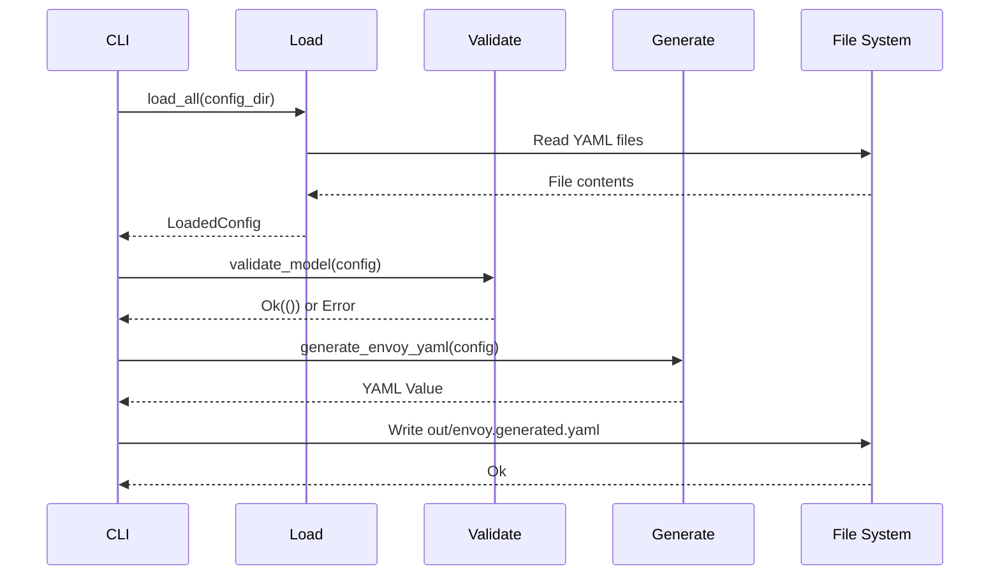
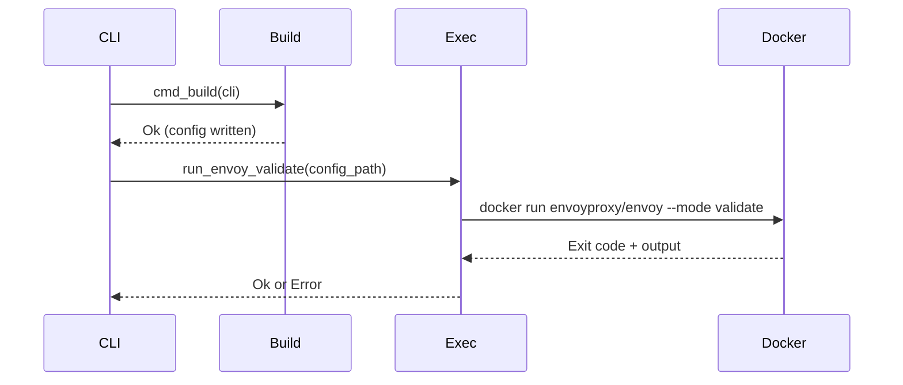
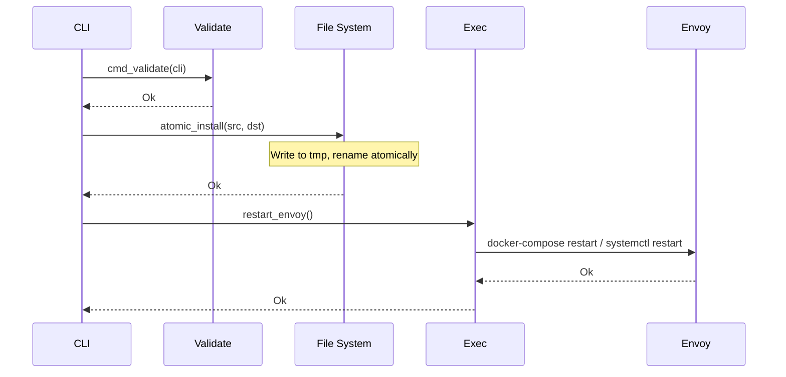

# Data Flow

This document describes how configuration data flows through envoyctl from input fragments to the final Envoy configuration.

---

## Overview

```mermaid
flowchart LR
    subgraph Input["Input Fragments"]
        D[domains/*.yaml]
        U[upstreams/*.yaml]
        P[policies/*.yaml]
        C[common/*.yaml]
    end

    subgraph Processing["Processing"]
        L[Load & Parse]
        V[Validate]
        G[Generate]
    end

    subgraph Output["Output"]
        O[envoy.generated.yaml]
        I[/etc/envoy/envoy.yaml]
    end

    D --> L
    U --> L
    P --> L
    C --> L
    L --> V
    V --> G
    G --> O
    O -->|apply| I
```

---

## Detailed Data Flow

### Stage 1: Loading

```
┌─────────────────────────────────────────────────────────────────────────┐
│                           load.rs                                        │
├─────────────────────────────────────────────────────────────────────────┤
│                                                                          │
│  config/common/defaults.yaml  ─────┐                                    │
│  config/common/admin.yaml     ─────┤                                    │
│  config/common/runtime.yaml   ─────┼────▶  LoadedConfig {               │
│                                    │          defaults: DefaultsSpec,   │
│  config/domains/*.yaml        ─────┤          admin: AdminSpec,         │
│                                    │          runtime: RuntimeSpec,     │
│  config/upstreams/*.yaml      ─────┤          domains: Vec<DomainSpec>, │
│                                    │          upstreams: Vec<Upstream>, │
│  config/policies/*.yaml       ─────┘          policies: PolicyBundle,   │
│                                             }                            │
│                                                                          │
└─────────────────────────────────────────────────────────────────────────┘
```

### Stage 2: Validation

```
┌─────────────────────────────────────────────────────────────────────────┐
│                         validate.rs                                      │
├─────────────────────────────────────────────────────────────────────────┤
│                                                                          │
│  LoadedConfig                                                            │
│       │                                                                  │
│       ▼                                                                  │
│  ┌─────────────────────────────────────────────────────────────┐        │
│  │  Validation Checks                                           │        │
│  ├─────────────────────────────────────────────────────────────┤        │
│  │  ✓ All domain.to_upstream references exist in upstreams     │        │
│  │  ✓ All policy references (rate limits, headers) exist       │        │
│  │  ✓ TLS cert paths are specified for terminate mode          │        │
│  │  ✓ Required fields are present and valid                    │        │
│  │  ✓ No duplicate domain names                                │        │
│  │  ✓ No duplicate upstream names                              │        │
│  └─────────────────────────────────────────────────────────────┘        │
│       │                                                                  │
│       ▼                                                                  │
│  Result<(), ValidationError>                                             │
│                                                                          │
└─────────────────────────────────────────────────────────────────────────┘
```

### Stage 3: Generation

```
┌─────────────────────────────────────────────────────────────────────────┐
│                         generate.rs                                      │
├─────────────────────────────────────────────────────────────────────────┤
│                                                                          │
│  LoadedConfig                                                            │
│       │                                                                  │
│       ▼                                                                  │
│  ┌───────────────────┐    ┌───────────────────┐                         │
│  │  Build Listeners  │    │  Build Clusters   │                         │
│  │  ───────────────  │    │  ───────────────  │                         │
│  │  • HTTP :80       │    │  • From upstreams │                         │
│  │  • HTTPS :443     │    │  • Endpoints      │                         │
│  │  • TLS terminate  │    │  • Health checks  │                         │
│  │  • TLS passthrough│    │  • Timeouts       │                         │
│  └─────────┬─────────┘    └─────────┬─────────┘                         │
│            │                        │                                    │
│            ▼                        ▼                                    │
│  ┌─────────────────────────────────────────────────────────────┐        │
│  │                    Envoy Config (YAML)                       │        │
│  │  ─────────────────────────────────────────────────────────  │        │
│  │  admin:                                                      │        │
│  │    address: ...                                              │        │
│  │  static_resources:                                           │        │
│  │    listeners:                                                │        │
│  │      - name: http_listener                                   │        │
│  │        filter_chains: ...                                    │        │
│  │      - name: https_listener                                  │        │
│  │        filter_chains: ...                                    │        │
│  │    clusters:                                                 │        │
│  │      - name: upstream_1                                      │        │
│  │        endpoints: ...                                        │        │
│  └─────────────────────────────────────────────────────────────┘        │
│                                                                          │
└─────────────────────────────────────────────────────────────────────────┘
```

---

## Fragment to Envoy Mapping

### Domain → Listener + Routes

```yaml
# Input: config/domains/example.com.yaml
domain: example.com
mode: terminate_https_443
tls:
  cert_chain: /etc/envoy/certs/example.com/fullchain.pem
  private_key: /etc/envoy/certs/example.com/privkey.pem
routes:
  - match: { prefix: "/" }
    to_upstream: backend
```

```yaml
# Output: Part of envoy.generated.yaml
static_resources:
  listeners:
    - name: https_listener
      address:
        socket_address: { address: 0.0.0.0, port_value: 443 }
      listener_filters:
        - name: tls_inspector
      filter_chains:
        - filter_chain_match:
            server_names: ["example.com"]
          transport_socket:
            name: envoy.transport_sockets.tls
            typed_config:
              "@type": type.googleapis.com/envoy.extensions.transport_sockets.tls.v3.DownstreamTlsContext
              common_tls_context:
                tls_certificates:
                  - certificate_chain: { filename: /etc/envoy/certs/example.com/fullchain.pem }
                    private_key: { filename: /etc/envoy/certs/example.com/privkey.pem }
          filters:
            - name: envoy.filters.network.http_connection_manager
              typed_config:
                route_config:
                  virtual_hosts:
                    - name: example.com
                      domains: ["example.com"]
                      routes:
                        - match: { prefix: "/" }
                          route: { cluster: backend }
```

### Upstream → Cluster

```yaml
# Input: config/upstreams/backend.yaml
name: backend
connect_timeout: 2s
type: STRICT_DNS
lb_policy: ROUND_ROBIN
http2: true
endpoints:
  - { address: "10.0.0.1", port: 8080 }
  - { address: "10.0.0.2", port: 8080 }
```

```yaml
# Output: Part of envoy.generated.yaml
static_resources:
  clusters:
    - name: backend
      connect_timeout: 2s
      type: STRICT_DNS
      lb_policy: ROUND_ROBIN
      typed_extension_protocol_options:
        envoy.extensions.upstreams.http.v3.HttpProtocolOptions:
          "@type": type.googleapis.com/envoy.extensions.upstreams.http.v3.HttpProtocolOptions
          explicit_http_config:
            http2_protocol_options: {}
      load_assignment:
        cluster_name: backend
        endpoints:
          - lb_endpoints:
              - endpoint:
                  address:
                    socket_address: { address: "10.0.0.1", port_value: 8080 }
              - endpoint:
                  address:
                    socket_address: { address: "10.0.0.2", port_value: 8080 }
```

---

## Command Flow

### `envoyctl build`



### `envoyctl validate`



### `envoyctl apply`



---

## Error Propagation

```
┌─────────────────────────────────────────────────────────────────────────┐
│                        Error Flow                                        │
├─────────────────────────────────────────────────────────────────────────┤
│                                                                          │
│  Load Error                                                              │
│  ├── File not found → "could not read config/domains/foo.yaml"          │
│  ├── Parse error → "YAML error at line 5: expected string"              │
│  └── Missing field → "domain.yaml: missing required field 'domain'"     │
│                                                                          │
│  Validation Error                                                        │
│  ├── Unknown upstream → "domain 'x.com' references unknown upstream 'y'"│
│  ├── Unknown policy → "route references unknown rate limit 'z'"         │
│  └── Duplicate name → "duplicate upstream name: 'backend'"              │
│                                                                          │
│  Generation Error                                                        │
│  └── Serialization → "failed to serialize envoy config"                 │
│                                                                          │
│  Envoy Validation Error                                                  │
│  └── Config invalid → "envoy validation failed: [envoy output]"         │
│                                                                          │
│  Apply Error                                                             │
│  ├── Install failed → "could not write to /etc/envoy/envoy.yaml"        │
│  └── Restart failed → "docker-compose restart failed: [output]"         │
│                                                                          │
└─────────────────────────────────────────────────────────────────────────┘
```

All errors include context and are propagated up using `anyhow::Result` with `.context()` for clear error messages.

