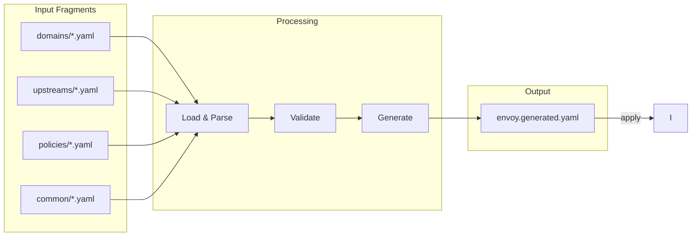
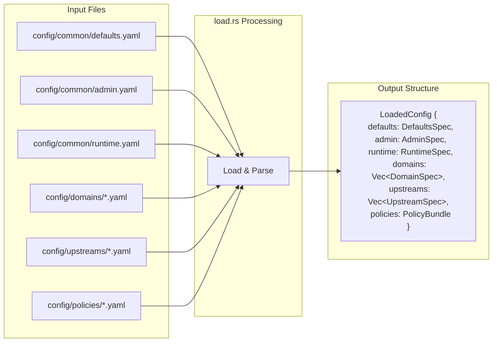
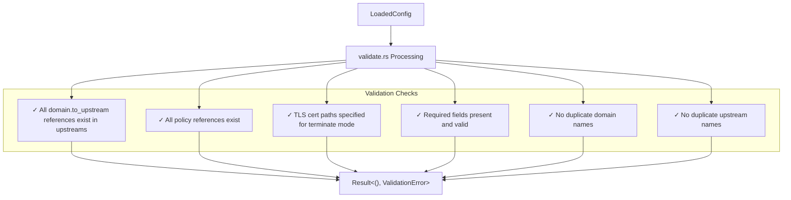
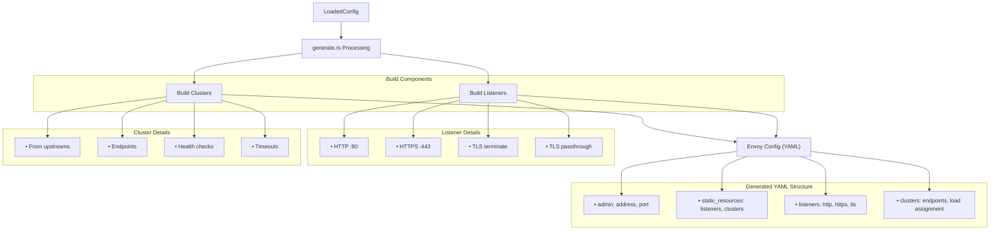
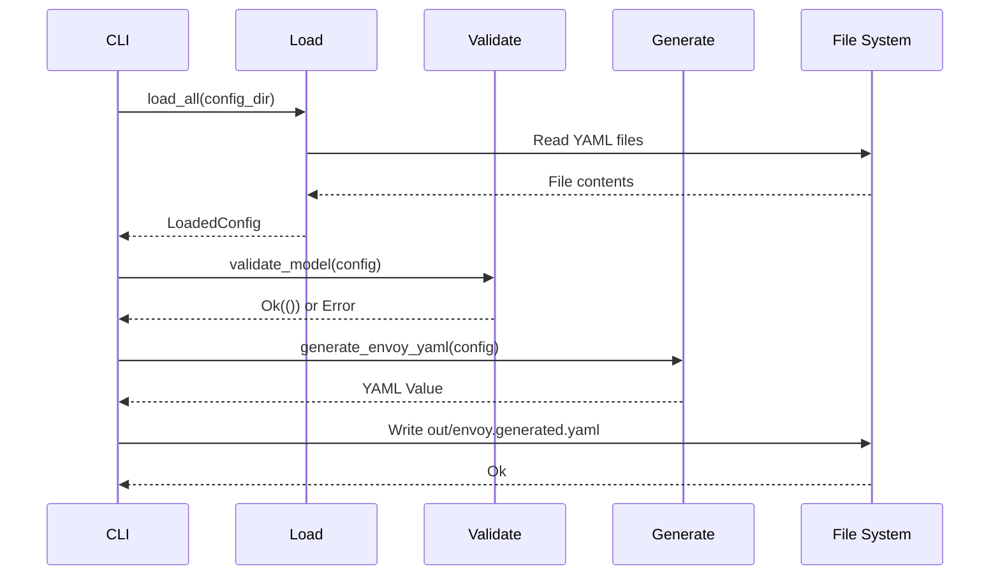
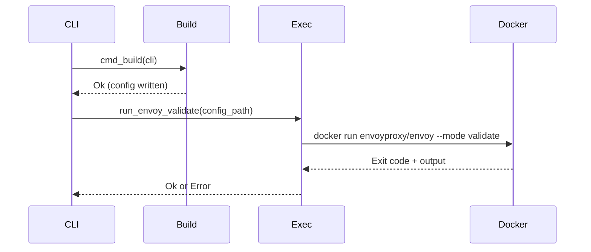
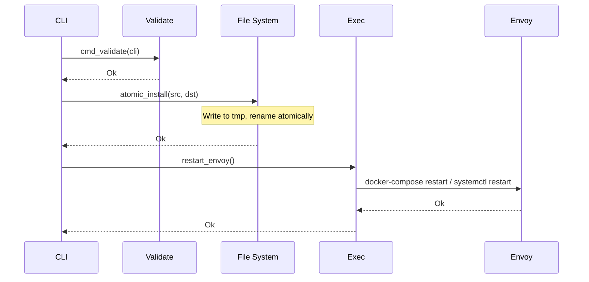

# Data Flow

This document describes how configuration data flows through envoyctl from input fragments to the final Envoy configuration.

---

## Overview



---

## Detailed Data Flow

### Stage 1: Loading



### Stage 2: Validation



### Stage 3: Generation



---

## Fragment to Envoy Mapping

### Domain → Listener + Routes

```yaml
# Input: config/domains/example.com.yaml
domain: example.com
mode: terminate_https_443
tls:
  cert_chain: /etc/envoy/certs/example.com/fullchain.pem
  private_key: /etc/envoy/certs/example.com/privkey.pem
routes:
  - match: { prefix: "/" }
    to_upstream: backend
```

```yaml
# Output: Part of envoy.generated.yaml
static_resources:
  listeners:
    - name: https_listener
      address:
        socket_address: { address: 0.0.0.0, port_value: 443 }
      listener_filters:
        - name: tls_inspector
      filter_chains:
        - filter_chain_match:
            server_names: ["example.com"]
          transport_socket:
            name: envoy.transport_sockets.tls
            typed_config:
              "@type": type.googleapis.com/envoy.extensions.transport_sockets.tls.v3.DownstreamTlsContext
              common_tls_context:
                tls_certificates:
                  - certificate_chain: { filename: /etc/envoy/certs/example.com/fullchain.pem }
                    private_key: { filename: /etc/envoy/certs/example.com/privkey.pem }
          filters:
            - name: envoy.filters.network.http_connection_manager
              typed_config:
                route_config:
                  virtual_hosts:
                    - name: example.com
                      domains: ["example.com"]
                      routes:
                        - match: { prefix: "/" }
                          route: { cluster: backend }
```

### Upstream → Cluster

```yaml
# Input: config/upstreams/backend.yaml
name: backend
connect_timeout: 2s
type: STRICT_DNS
lb_policy: ROUND_ROBIN
http2: true
endpoints:
  - { address: "10.0.0.1", port: 8080 }
  - { address: "10.0.0.2", port: 8080 }
```

```yaml
# Output: Part of envoy.generated.yaml
static_resources:
  clusters:
    - name: backend
      connect_timeout: 2s
      type: STRICT_DNS
      lb_policy: ROUND_ROBIN
      typed_extension_protocol_options:
        envoy.extensions.upstreams.http.v3.HttpProtocolOptions:
          "@type": type.googleapis.com/envoy.extensions.upstreams.http.v3.HttpProtocolOptions
          explicit_http_config:
            http2_protocol_options: {}
      load_assignment:
        cluster_name: backend
        endpoints:
          - lb_endpoints:
              - endpoint:
                  address:
                    socket_address: { address: "10.0.0.1", port_value: 8080 }
              - endpoint:
                  address:
                    socket_address: { address: "10.0.0.2", port_value: 8080 }
```

---

## Command Flow

### `envoyctl build`



### `envoyctl validate`



### `envoyctl apply`



---

## Error Propagation

```mermaid
graph TB
    subgraph "Load Error"
        A1["File not found"]
        A2["Parse error"]
        A3["Missing field"]
    end

    subgraph "Validation Error"
        B1["Unknown upstream"]
        B2["Unknown policy"]
        B3["Duplicate name"]
    end

    subgraph "Generation Error"
        C1["Serialization"]
    end

    subgraph "Envoy Validation Error"
        D1["Config invalid"]
    end

    subgraph "Apply Error"
        E1["Install failed"]
        E2["Restart failed"]
    end

    A1 --> A_out["'could not read config/domains/foo.yaml'"]
    A2 --> A_out2["'YAML error at line 5: expected string'"]
    A3 --> A_out3["'domain.yaml: missing required field domain'"]

    B1 --> B_out["'domain x.com references unknown upstream y'"]
    B2 --> B_out2["'route references unknown rate limit z'"]
    B3 --> B_out3["'duplicate upstream name: backend'"]

    C1 --> C_out["'failed to serialize envoy config'"]

    D1 --> D_out["'envoy validation failed: [envoy output]'"]

    E1 --> E_out["'could not write to /etc/envoy/envoy.yaml'"]
    E2 --> E_out2["'docker-compose restart failed: [output]'"]

    A_out --> ErrorHandling["Error Handling with anyhow::Result"]
    A_out2 --> ErrorHandling
    A_out3 --> ErrorHandling
    B_out --> ErrorHandling
    B_out2 --> ErrorHandling
    B_out3 --> ErrorHandling
    C_out --> ErrorHandling
    D_out --> ErrorHandling
    E_out --> ErrorHandling
    E_out2 --> ErrorHandling
```



All errors include context and are propagated up using `anyhow::Result` with `.context()` for clear error messages.

